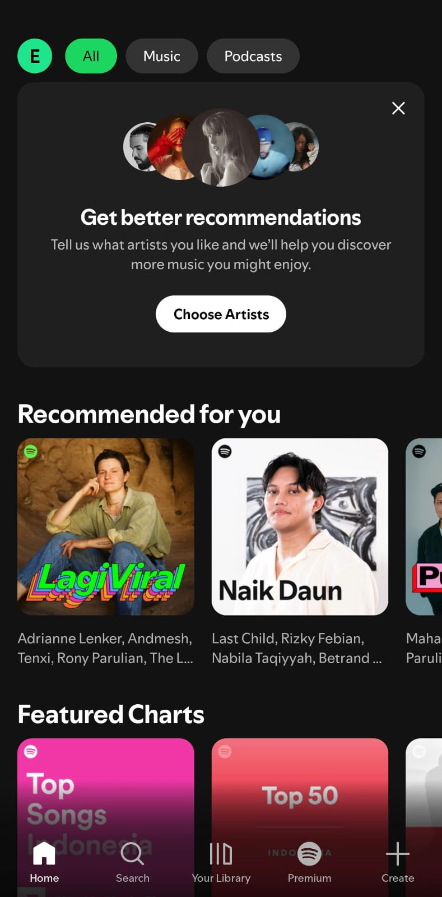
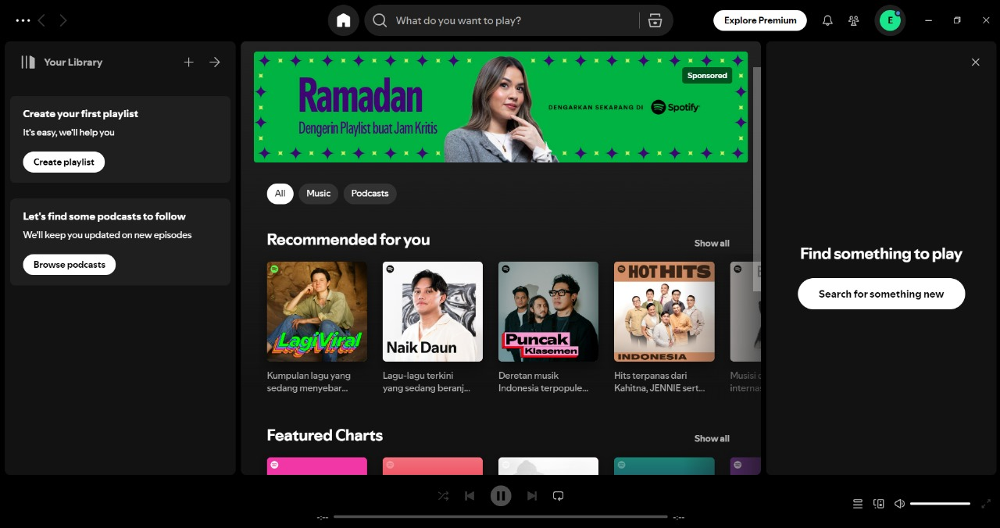
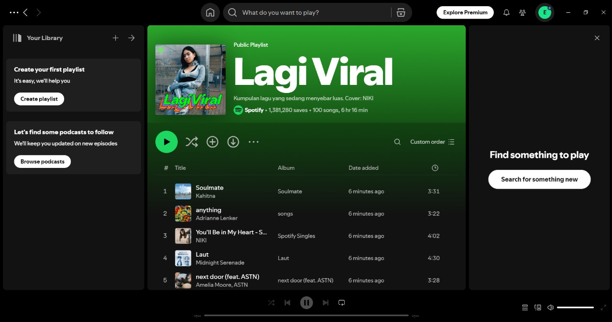
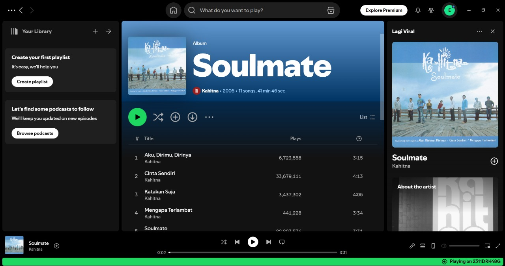
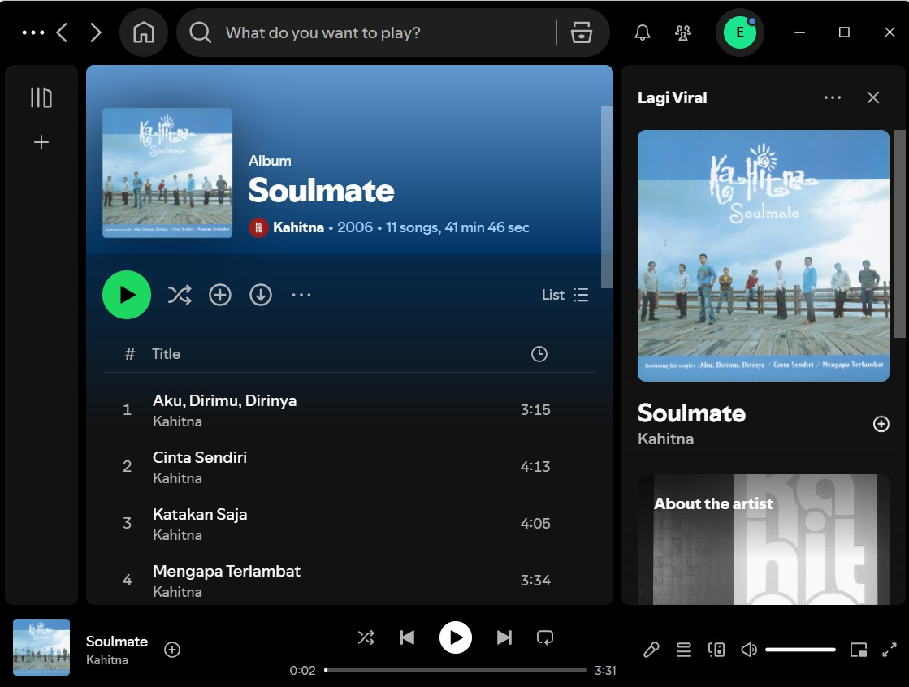

**22100035 - Edwin Theonardi**
# Responsive & Adaptive UI pada Spotify  

### 📱 **Tampilan Mobile**  
  

### 🖥️ **Tampilan Desktop**
 
 

Spotify menerapkan **responsive UI** untuk menyesuaikan ukuran elemen seperti teks, gambar album, dan tombol agar tetap proporsional di semua layar. Misalnya pada perangkat **mobile**, elemen UI seperti tombol **play, pause, dan next** dibuat dengan ukuran yang lebih besar dan mudah dijangkau dengan satu tangan. Selain itu, daftar lagu juga ditampilkan dengan format yang lebih padat namun tetap jelas terbaca. Sementara itu, pada perangkat **desktop**, responsive UI diterapkan untuk menyesuaikan tata letak dan ukuran elemen berdasarkan ukuran window aplikasi. Jika window diperbesar, elemen seperti **daftar lagu dan sidebar** akan menyesuaikan agar tetap proporsional. Sebaliknya jika diperkecil, beberapa elemen akan mengecil atau bahkan tersembunyi untuk menjaga tampilan tetap rapi.

Selain itu, Spotify juga menerapkan **adaptive design** dengan menyesuaikan tampilan pada perangkat yang digunakan. Misalnya pada perangkat **mobile**, tampilan **pemutar musik** dibuat dengan lebih sederhana dengan fokus pada tombol-tombol utama seperti **play/pause, next, dan previous**, sementara fitur lain seperti **lyrics dan queue** dibuat pada halaman lain agar layar tidak penuh. Dan juga pada perangkat mobile, navigasi lebih berbasis **ikon** dan berada di **bawah** untuk mempermudah navigasi. Sementara itu, pada perangkat **desktop**, karena memiliki layar yang lebih besar maka tampilan dibuat lebih luas. Adanya **sidebar pada sisi kiri** untuk mempermudah navigasi untuk playlist, album, dan pencarian serta tampilan **Now Playing** yang lebih besar dan juga akses langsung ke fitur **lyrics dan queue** sehingga pengguna bisa menikmati lebih banyak fitur karena memiliki layar yang lebih besar.

**UX (User Experience)** penting untuk membantu mendesain UI yang lebih baik karena dengan melalui **UX research** maka Spotify dapat mengetahui perilaku pengguna ketika mendengarkan musik pada berbagai perangkat sehingga dapat membantu mereka dalam menentukan bagaimana desain terbaik pada perangkat **mobile atau desktop** yang dapat memberikan kenyamanan pada pengguna.

